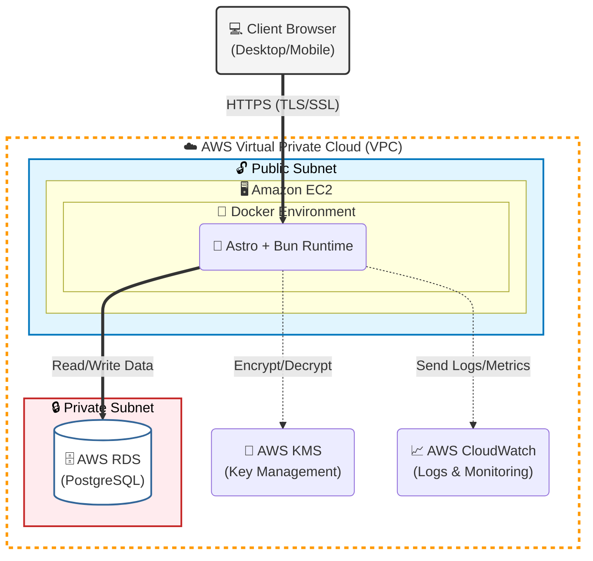
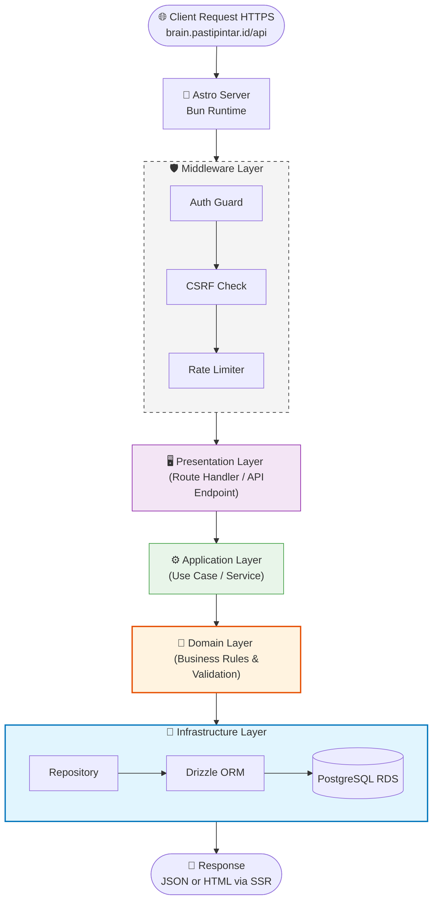
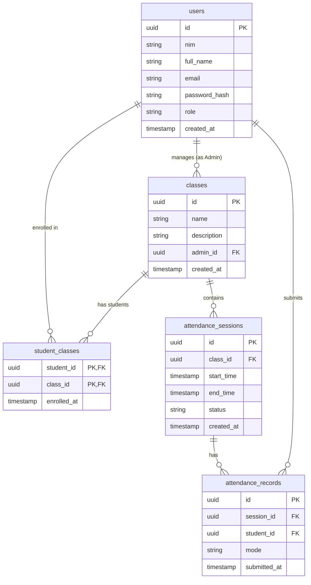

# Software Development Design (SDD)
*University Student Attendance Management System*

**Version**: 1.0  
**Date**: 2026-05-30

---

## Table of Contents

1. [Introduction](#1-introduction)
2. [System Overview](#2-system-overview)
3. [Architecture Design](#3-architecture-design)
4. [Module Design](#4-module-design)
5. [Database Design](#5-database-design)
6. [API Design](#6-api-design)
7. [UI/UX Design](#7-uiux-design)
8. [Security Design](#8-security-design)
9. [Infrastructure & Deployment Design](#9-infrastructure--deployment-design)
10. [Non-Functional Design Considerations](#10-non-functional-design-considerations)

---

## 1. Introduction

### 1.1 Purpose

This Software Development Design (SDD) document translates the requirements outlined in the Software Requirements Specification (SRS) into a concrete technical blueprint. It describes the system's architecture, module decomposition, data models, API contracts, and infrastructure layout to guide the development team through implementation.

### 1.2 Scope

This document covers the complete design of the web-based University Student Attendance Management System, including:

- Modular monolith application structure (Astro + Bun)
- Database schema and entity relationships
- RESTful API endpoint definitions
- UI page structure and component layout
- AWS infrastructure topology
- Security implementation patterns

### 1.3 Intended Audience

- Backend and frontend developers
- DevOps / infrastructure engineers
- QA and testing teams
- Project stakeholders for review

### 1.4 Definitions and Acronyms

| Term | Definition |
|---|---|
| **NIM** | Nomor Induk Mahasiswa — 15-digit Student Identification Number |
| **Luring** | Luar Jaringan — Offline/In-person attendance mode |
| **Daring** | Dalam Jaringan — Online/Virtual attendance mode |
| **RBAC** | Role-Based Access Control |
| **SRS** | Software Requirements Specification |
| **SDD** | Software Development Design |
| **SSR** | Server-Side Rendering |
| **JWT** | JSON Web Token |
| **VPC** | Virtual Private Cloud |
| **RDS** | Relational Database Service (AWS) |
| **EC2** | Elastic Compute Cloud (AWS) |
| **KMS** | Key Management Service (AWS) |

---

## 2. System Overview

The system is a **Modular Monolith** web application that digitizes university attendance management. It serves two user roles — **Admin** (Lecturer/Staff) and **User** (Student) — through role-specific dashboards.

**Core interactions:**

1. Admins create classes and open time-bound attendance sessions.
2. Students log in, view active sessions, and submit their attendance (Luring or Daring).
3. The system enforces time windows; submissions outside a session's window are rejected.
4. Both roles can view historical attendance data.

---

## 3. Architecture Design

### 3.1 Architectural Pattern: Modular Monolith with Clean Architecture

The application is deployed as a single unit but is internally divided into self-contained feature modules. Each module follows a layered structure:

```
src/
├── modules/
│   ├── auth/
│   │   ├── domain/          # Entities, value objects, interfaces
│   │   ├── application/     # Use cases / services
│   │   ├── infrastructure/  # DB repositories, external adapters
│   │   └── presentation/    # Astro pages, API route handlers
│   ├── class/
│   │   ├── domain/
│   │   ├── application/
│   │   ├── infrastructure/
│   │   └── presentation/
│   ├── session/
│   │   ├── domain/
│   │   ├── application/
│   │   ├── infrastructure/
│   │   └── presentation/
│   └── attendance/
│       ├── domain/
│       ├── application/
│       ├── infrastructure/
│       └── presentation/
├── shared/
│   ├── middleware/          # Auth guards, rate limiters, CSRF
│   ├── utils/               # Helpers, validators, formatters
│   └── config/              # Environment, DB connection, constants
└── pages/                   # Astro top-level pages (route entry points)
```

**Dependency Rule:** Inner layers (domain, application) must never import from outer layers (infrastructure, presentation). All dependencies point inward.

### 3.2 Technology Stack

| Layer | Technology | Rationale |
|---|---|---|
| Framework | Astro | SSR + static UI generation; minimal JS by default |
| Runtime | Bun | High-performance JS/TS runtime; fast package management |
| Language | TypeScript | Type safety across the codebase |
| Database | PostgreSQL (via AWS RDS) | Robust relational data; ACID compliance for attendance records |
| ORM | Drizzle ORM | Lightweight, type-safe; works natively with Bun |
| Auth | JWT (HTTP-only Cookies) | Stateless, secure session management |
| Containerization | Docker | Environment parity across dev, staging, production |
| Cloud | AWS (VPC, EC2, RDS, KMS, CloudWatch) | Scalable, secure managed infrastructure |

### 3.3 High-Level System Diagram



### 3.4 Request Lifecycle



---

## 4. Module Design

### 4.1 Auth Module

**Responsibility:** User registration, login, JWT issuance, and role-based access control.

**Domain Entities:**

```typescript
interface User {
  id: string;          // UUID
  nim: string;         // 15-digit, students only
  fullName: string;
  email: string;
  passwordHash: string;
  role: 'admin' | 'student';
  createdAt: Date;
}
```

**Use Cases:**

| Use Case | Actor | Description |
|---|---|---|
| `RegisterStudent` | Student | Validates NIM format, hashes password, stores user |
| `Login` | Admin / Student | Verifies credentials, issues JWT in HTTP-only cookie |
| `Logout` | Admin / Student | Invalidates session by clearing cookie |
| `GetCurrentUser` | Admin / Student | Decodes JWT, returns session user data |

**Key Design Decisions:**

- Passwords hashed with **Argon2id** (preferred) or bcrypt (fallback).
- JWT stored in **HTTP-only, Secure, SameSite=Strict** cookies to prevent XSS theft.
- Role is embedded in the JWT payload for RBAC enforcement at middleware level.
- NIM validated via regex: `/^\d{15}$/`.

---

### 4.2 Class Module

**Responsibility:** CRUD operations for class entities managed by Admins.

**Domain Entities:**

```typescript
interface Class {
  id: string;          // UUID
  name: string;        // e.g., "Data Structures"
  description?: string;
  adminId: string;     // FK → User (Admin)
  createdAt: Date;
}

interface StudentClass {
  studentId: string;   // FK → User (Student)
  classId: string;     // FK → Class
  enrolledAt: Date;
}
```

**Use Cases:**

| Use Case | Actor | Description |
|---|---|---|
| `CreateClass` | Admin | Creates a new class entity |
| `ListClasses` | Admin | Returns all classes owned by the Admin |
| `GetClassDetails` | Admin | Returns a class with its session history |
| `EnrollStudent` | Admin | Links a student to a class |
| `GetStudentClasses` | Student | Returns all classes the student is enrolled in |

---

### 4.3 Session Module

**Responsibility:** Managing time-bound attendance sessions within classes.

**Domain Entities:**

```typescript
interface AttendanceSession {
  id: string;             // UUID
  classId: string;        // FK → Class
  startTime: Date;        // Session open time
  endTime: Date;          // Session close time (auto-enforced)
  status: 'active' | 'closed';
  createdAt: Date;
}
```

**Use Cases:**

| Use Case | Actor | Description |
|---|---|---|
| `InitiateSession` | Admin | Creates a session with defined start/end times |
| `CloseSession` | Admin / System | Manually closes or auto-closes at `endTime` |
| `GetActiveSessions` | Student | Returns sessions currently open for enrolled classes |
| `ListSessionsByClass` | Admin | Returns all sessions for a given class |

**Auto-Close Mechanism:**

A background scheduler (Bun cron job or database-level check on query) compares `endTime` to the current server timestamp on every session query. Sessions past their `endTime` are returned with `status: 'closed'` without a separate background process, avoiding race conditions.

```typescript
// Applied in the repository layer on every session fetch
WHERE end_time > NOW() AND status = 'active'
```

---

### 4.4 Attendance Module

**Responsibility:** Recording student attendance submissions within valid session windows.

**Domain Entities:**

```typescript
interface AttendanceRecord {
  id: string;             // UUID
  sessionId: string;      // FK → AttendanceSession
  studentId: string;      // FK → User (Student)
  mode: 'luring' | 'daring';
  submittedAt: Date;
}
```

**Use Cases:**

| Use Case | Actor | Description |
|---|---|---|
| `SubmitAttendance` | Student | Records presence; validates time window and no duplicate |
| `GetAttendanceBySession` | Admin | Returns all records for a session |
| `GetStudentAttendanceHistory` | Student | Returns student's historical records |
| `ExportAttendanceReport` | Admin | Exports records as CSV for a class or session |

**Time Validation Logic (Domain Rule):**

```typescript
function validateSubmissionWindow(session: AttendanceSession): void {
  const now = new Date();
  if (now < session.startTime || now > session.endTime) {
    throw new AttendanceWindowError(
      'Attendance submission is outside the allowed time window.'
    );
  }
}
```

**Duplicate Prevention:** A unique constraint on `(sessionId, studentId)` at the database level ensures a student can only submit once per session.

---

## 5. Database Design

### 5.1 Entity-Relationship Diagram



### 5.2 Table Definitions

**`users`**

| Column | Type | Constraints |
|---|---|---|
| `id` | UUID | PRIMARY KEY, DEFAULT gen_random_uuid() |
| `nim` | VARCHAR(15) | UNIQUE, NULLABLE (null for Admins) |
| `full_name` | VARCHAR(255) | NOT NULL |
| `email` | VARCHAR(255) | UNIQUE, NOT NULL |
| `password_hash` | TEXT | NOT NULL |
| `role` | ENUM('admin','student') | NOT NULL, DEFAULT 'student' |
| `created_at` | TIMESTAMPTZ | NOT NULL, DEFAULT NOW() |

**`classes`**

| Column | Type | Constraints |
|---|---|---|
| `id` | UUID | PRIMARY KEY |
| `name` | VARCHAR(255) | NOT NULL |
| `description` | TEXT | NULLABLE |
| `admin_id` | UUID | NOT NULL, FK → users(id) |
| `created_at` | TIMESTAMPTZ | NOT NULL, DEFAULT NOW() |

**`student_classes`**

| Column | Type | Constraints |
|---|---|---|
| `student_id` | UUID | NOT NULL, FK → users(id) |
| `class_id` | UUID | NOT NULL, FK → classes(id) |
| `enrolled_at` | TIMESTAMPTZ | NOT NULL, DEFAULT NOW() |
| — | — | PRIMARY KEY (student_id, class_id) |

**`attendance_sessions`**

| Column | Type | Constraints |
|---|---|---|
| `id` | UUID | PRIMARY KEY |
| `class_id` | UUID | NOT NULL, FK → classes(id) |
| `start_time` | TIMESTAMPTZ | NOT NULL |
| `end_time` | TIMESTAMPTZ | NOT NULL |
| `status` | ENUM('active','closed') | NOT NULL, DEFAULT 'active' |
| `created_at` | TIMESTAMPTZ | NOT NULL, DEFAULT NOW() |

**`attendance_records`**

| Column | Type | Constraints |
|---|---|---|
| `id` | UUID | PRIMARY KEY |
| `session_id` | UUID | NOT NULL, FK → attendance_sessions(id) |
| `student_id` | UUID | NOT NULL, FK → users(id) |
| `mode` | ENUM('luring','daring') | NOT NULL |
| `submitted_at` | TIMESTAMPTZ | NOT NULL, DEFAULT NOW() |
| — | — | UNIQUE (session_id, student_id) |

---

## 6. API Design

All API routes are prefixed with `/api/v1`. Responses follow a consistent JSON envelope:

```json
{
  "success": true,
  "data": { ... },
  "message": "Human-readable status"
}
```

Errors return appropriate HTTP status codes with:

```json
{
  "success": false,
  "error": "Error type",
  "message": "Description of the problem"
}
```

### 6.1 Auth Endpoints

| Method | Endpoint | Auth | Description |
|---|---|---|---|
| `POST` | `/api/v1/auth/register` | Public | Student registration |
| `POST` | `/api/v1/auth/login` | Public | Login for Admin & Student |
| `POST` | `/api/v1/auth/logout` | Required | Clear session cookie |
| `GET` | `/api/v1/auth/me` | Required | Get current user info |

**POST `/api/v1/auth/register` — Request Body:**

```json
{
  "fullName": "Budi Santoso",
  "nim": "235150301111028",
  "email": "budi@student.ub.ac.id",
  "password": "SecurePass123!"
}
```

**POST `/api/v1/auth/login` — Request Body:**

```json
{
  "email": "budi@student.ub.ac.id",
  "password": "SecurePass123!"
}
```

### 6.2 Class Endpoints

| Method | Endpoint | Auth | Role | Description |
|---|---|---|---|---|
| `POST` | `/api/v1/classes` | Required | Admin | Create a new class |
| `GET` | `/api/v1/classes` | Required | Admin | List admin's classes |
| `GET` | `/api/v1/classes/:id` | Required | Admin | Get class details |
| `POST` | `/api/v1/classes/:id/enroll` | Required | Admin | Enroll a student |
| `GET` | `/api/v1/student/classes` | Required | Student | Get enrolled classes |

### 6.3 Session Endpoints

| Method | Endpoint | Auth | Role | Description |
|---|---|---|---|---|
| `POST` | `/api/v1/classes/:id/sessions` | Required | Admin | Initiate a new session |
| `PATCH` | `/api/v1/sessions/:id/close` | Required | Admin | Manually close a session |
| `GET` | `/api/v1/classes/:id/sessions` | Required | Admin | List all sessions for a class |
| `GET` | `/api/v1/student/sessions/active` | Required | Student | Get active sessions for enrolled classes |

**POST `/api/v1/classes/:id/sessions` — Request Body:**

```json
{
  "startTime": "2026-05-30T08:00:00Z",
  "endTime": "2026-05-30T08:20:00Z"
}
```

### 6.4 Attendance Endpoints

| Method | Endpoint | Auth | Role | Description |
|---|---|---|---|---|
| `POST` | `/api/v1/attendance` | Required | Student | Submit attendance |
| `GET` | `/api/v1/sessions/:id/attendance` | Required | Admin | View attendance for a session |
| `GET` | `/api/v1/student/attendance` | Required | Student | View personal attendance history |
| `GET` | `/api/v1/sessions/:id/attendance/export` | Required | Admin | Export session attendance as CSV |

**POST `/api/v1/attendance` — Request Body:**

```json
{
  "sessionId": "uuid-of-session",
  "mode": "luring"
}
```

**Error — Submission Outside Time Window (HTTP 422):**

```json
{
  "success": false,
  "error": "AttendanceWindowError",
  "message": "Attendance submission is outside the allowed time window."
}
```

**Error — Duplicate Submission (HTTP 409):**

```json
{
  "success": false,
  "error": "DuplicateAttendanceError",
  "message": "You have already submitted attendance for this session."
}
```

---

## 7. UI/UX Design

### 7.1 Page Map

```
/                          → Redirect to /login
/login                     → Login Page (Admin & Student)
/register                  → Student Registration Page

/admin/dashboard           → Admin Dashboard
/admin/classes             → Class List
/admin/classes/new         → Create Class Form
/admin/classes/:id         → Class Detail + Session Management
/admin/classes/:id/sessions/:sid → Session Attendance Viewer

/student/dashboard         → Student Dashboard
/student/attendance        → Personal Attendance History
```

### 7.2 Page Descriptions

**Login Page (`/login`)**

- Single form: email + password fields, submit button.
- On success: redirects to `/admin/dashboard` or `/student/dashboard` based on role.
- Displays error message on invalid credentials.

**Student Registration Page (`/register`)**

- Fields: Full Name, NIM (validated 15-digit), Email, Password, Confirm Password.
- Inline validation feedback before submission.
- On success: redirect to `/login` with success toast.

**Admin Dashboard (`/admin/dashboard`)**

- Summary cards: total classes, active sessions, total students.
- Table of recent sessions with open/close status.
- Quick action button: "Open New Session."

**Admin Class Detail (`/admin/classes/:id`)**

- Class name and enrolled student count.
- Button: "Initiate Session" — opens a modal with start time / end time pickers.
- Session history table: columns for date, start time, end time, status, attendance count, and view/export links.

**Student Dashboard (`/student/dashboard`)**

- List of enrolled classes with current attendance percentage badge.
- Highlighted "Active Session" card per class when a session is open.
- Each active card has: class name, session closes at (countdown), and "Submit Attendance" button.
- Modal notification if student has already submitted for an active session.

**Attendance Submission Flow (Student)**

1. Student taps "Submit Attendance" on an active session card.
2. Modal appears: radio buttons for **Luring** / **Daring** mode selection.
3. Student confirms → `POST /api/v1/attendance` is called.
4. Success: modal closes, card updates to "Attended ✓."
5. Error (window closed or duplicate): error message shown in modal.

### 7.3 Component Hierarchy (Key Components)

```
<Layout>
  <Navbar />
  <Sidebar />                          ← Admin only
  <main>
    <!-- Admin -->
    <DashboardSummaryCards />
    <SessionTable />
    <ClassCard />
    <InitiateSessionModal />           ← Controlled modal
    <AttendanceExportButton />

    <!-- Student -->
    <StudentDashboardHeader />
    <ActiveSessionCard>
      <AttendanceSubmitModal />        ← Radio: Luring / Daring
    </ActiveSessionCard>
    <AttendanceHistoryTable />
  </main>
</Layout>
```

---

## 8. Security Design

### 8.1 Authentication & Session Management

- JWT issued on login, signed with a secret stored in AWS KMS.
- Token stored as an **HTTP-only, Secure, SameSite=Strict** cookie; never exposed to JavaScript.
- Token expiry: **8 hours** (aligns with a typical university day).
- On logout, cookie is cleared server-side.

### 8.2 Authorization (RBAC)

A middleware guard runs on every protected route:

```typescript
async function authGuard(context, requiredRole?: 'admin' | 'student') {
  const token = context.cookies.get('session')?.value;
  if (!token) return redirect('/login');
  
  const user = verifyJWT(token); // Throws on invalid/expired
  if (requiredRole && user.role !== requiredRole) {
    return new Response('Forbidden', { status: 403 });
  }

  context.locals.user = user;
}
```

### 8.3 Password Security

- Passwords hashed with **Argon2id** (memory: 64MB, iterations: 3, parallelism: 4).
- Raw passwords are never logged or stored.
- Database credentials managed via AWS KMS; injected as environment variables at runtime.

### 8.4 CSRF Protection

- All state-changing API routes (`POST`, `PATCH`, `DELETE`) validate a **CSRF token** sent in a request header (`X-CSRF-Token`).
- CSRF token generated per session and stored in a separate non-HTTP-only cookie for JS access.

### 8.5 Rate Limiting

Implemented at the middleware layer using an in-memory store (or Redis for multi-instance scaling):

| Endpoint | Limit |
|---|---|
| `POST /api/v1/auth/login` | 10 requests / 15 minutes per IP |
| `POST /api/v1/attendance` | 5 requests / minute per user |
| All other API routes | 60 requests / minute per user |

### 8.6 Data Encryption in Transit

- All traffic served over **HTTPS** with TLS 1.2+ enforced at the load balancer / EC2 level.
- HTTP requests automatically redirected to HTTPS.

---

## 9. Infrastructure & Deployment Design

### 9.1 AWS Architecture

| Service | Configuration |
|---|---|
| **VPC** | One VPC with public subnet (EC2) and private subnet (RDS). Internet Gateway on public subnet. NAT Gateway for outbound from private subnet. |
| **EC2** | Instance type: `t3.small` (adjustable). Security group: inbound port 443 (HTTPS) and 22 (SSH, restricted to admin IP). Outbound: all. |
| **RDS** | PostgreSQL 16, `db.t3.micro`. Deployed in private subnet. Multi-AZ disabled (cost-optimized for university scale; enable for production hardening). Automated daily backups, 7-day retention. |
| **KMS** | Customer-managed key (CMK) used to encrypt: RDS storage, environment secrets (JWT secret, DB credentials). |
| **CloudWatch** | Log group for Docker container stdout/stderr. EC2 metrics: CPU, memory, disk. Alarms: CPU > 80% for 5 min → SNS notification. |

### 9.2 Docker Configuration

**Dockerfile:**

```dockerfile
FROM oven/bun:1 AS base
WORKDIR /app

# Install dependencies
COPY package.json bun.lockb ./
RUN bun install --frozen-lockfile

# Copy source
COPY . .

# Build Astro
RUN bun run build

# Production stage
FROM oven/bun:1-slim
WORKDIR /app
COPY --from=base /app/dist ./dist
COPY --from=base /app/node_modules ./node_modules
COPY --from=base /app/package.json ./

EXPOSE 4321
CMD ["bun", "run", "start"]
```

**docker-compose.yml (Development):**

```yaml
version: '3.8'
services:
  app:
    build: .
    ports:
      - "4321:4321"
    environment:
      - DATABASE_URL=postgresql://postgres:password@db:5432/attendance_db
      - JWT_SECRET=${JWT_SECRET}
    depends_on:
      - db

  db:
    image: postgres:16-alpine
    environment:
      POSTGRES_DB: attendance_db
      POSTGRES_USER: postgres
      POSTGRES_PASSWORD: password
    ports:
      - "5432:5432"
    volumes:
      - pg_data:/var/lib/postgresql/data

volumes:
  pg_data:
```

### 9.3 CI/CD Pipeline (Recommended)

```
Developer Push (GitHub)
        │
        ▼
GitHub Actions
  ├── Lint & Type Check (bun run lint)
  ├── Unit Tests (bun test)
  ├── Build Docker Image
  └── Push to Amazon ECR
        │
        ▼
EC2 Deploy Script
  ├── Pull latest image from ECR
  ├── Run DB migrations (bun run db:migrate)
  └── Restart Docker container (zero-downtime via health check)
```

### 9.4 Environment Variables

| Variable | Description | Source |
|---|---|---|
| `DATABASE_URL` | PostgreSQL connection string | AWS KMS / Secrets Manager |
| `JWT_SECRET` | Secret for signing JWTs | AWS KMS / Secrets Manager |
| `JWT_EXPIRY` | Token lifetime (e.g., `8h`) | Environment config |
| `NODE_ENV` | `production` / `development` | Docker environment |
| `PORT` | Application port (default `4321`) | Docker environment |

---

## 10. Non-Functional Design Considerations

### 10.1 Performance

- **Bun runtime** handles concurrent requests natively with its fast HTTP server.
- Database queries on `attendance_records` use indexes on `(session_id, student_id)` and `(student_id)` for fast lookups during peak submission periods.
- SSR via Astro pre-renders dashboard shells; only dynamic data (active sessions, attendance counts) is fetched client-side or via server endpoints.
- Connection pooling via Drizzle ORM limits max DB connections to prevent RDS overload.

### 10.2 Reliability & Uptime

- **Target**: 99.9% uptime during university operating hours (07:00–21:00 local time).
- Docker container configured with `restart: always` policy.
- CloudWatch alarms notify administrators of EC2 health issues.
- RDS automated backups ensure point-in-time recovery within 7 days.

### 10.3 Scalability Path

The modular monolith is designed to scale vertically (larger EC2 instance) for the current university scope. If usage grows significantly, modules can be extracted into independent microservices without redesigning the domain logic, due to the clean architecture separation.

### 10.4 Usability & Responsiveness

- Astro generates mobile-first, responsive HTML.
- Student-facing pages prioritize fast load on mobile networks (minimal JavaScript).
- Attendance submission modal is optimized for one-thumb mobile operation.

### 10.5 Observability

- All application errors are caught and logged to CloudWatch with a structured format: `{ timestamp, level, module, message, userId, requestId }`.
- CloudWatch dashboard tracks: active sessions count, attendance submissions per minute, error rate, and EC2 CPU utilization.

---

*End of Software Development Design Document*
